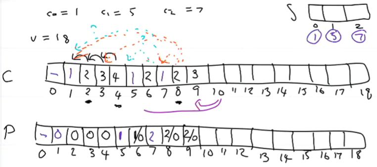

-
- Slides
	- 
	- 
- Some algorithms only work in polynomial time through the means of dynamic program
- ## Divide and Conquer
	- Generally you:
		- Preprocessin to construct smaller sub-problems
		- k recursive calls to compute the answer for the sub-problems
		- Take the answers from 2 to solve a greater problem
- ## Memoization
	- ## Fibonacci
		- Basic recursive implementation is VERY slow (1.6)^n
		- ((63c91e49-524d-4656-bda9-b720bb03b142))
		- Through dynamic programming, turn recursion upside down
		- This runs in O(n) and has a space of O(n)
		- ((63c91fa6-e1a8-449f-a0bf-657cc61cd676))
		- I don't quite understand but this is really cool
		- For functions that are static, saves previous answers and returns from a table
	- ## Coin Changing
		- In a coin system whre the only coins that exist are 1,5,7; the optimal change of 18 is 1,5,5,7 however the greedy algo would return 7,7,1,1,1,1
		- 
- # Seam Carving
	- ## Definition
	- In a image I of dimensions m × n, we define a vertical seam to be any sequence ((63ce8bdb-060d-423e-b07c-a1b60ada7648))such that for every $$  i∈ [m] \ {1}$$, we have $$ |j_i − j_\text{i−1}| ≤ 1 \space and \space 2 ≤ j_i ≤ n − 1$$
	-
	- ## Energy
	- Vertical  $$e(s) = \sum_{i=1}^{m}e_I(i,j_i)$$
	-